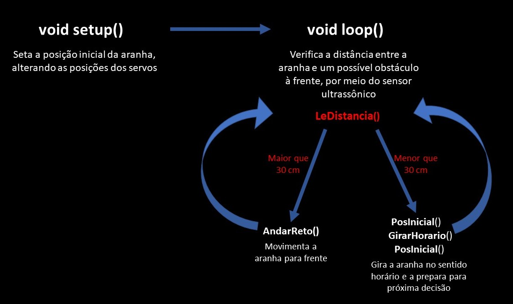
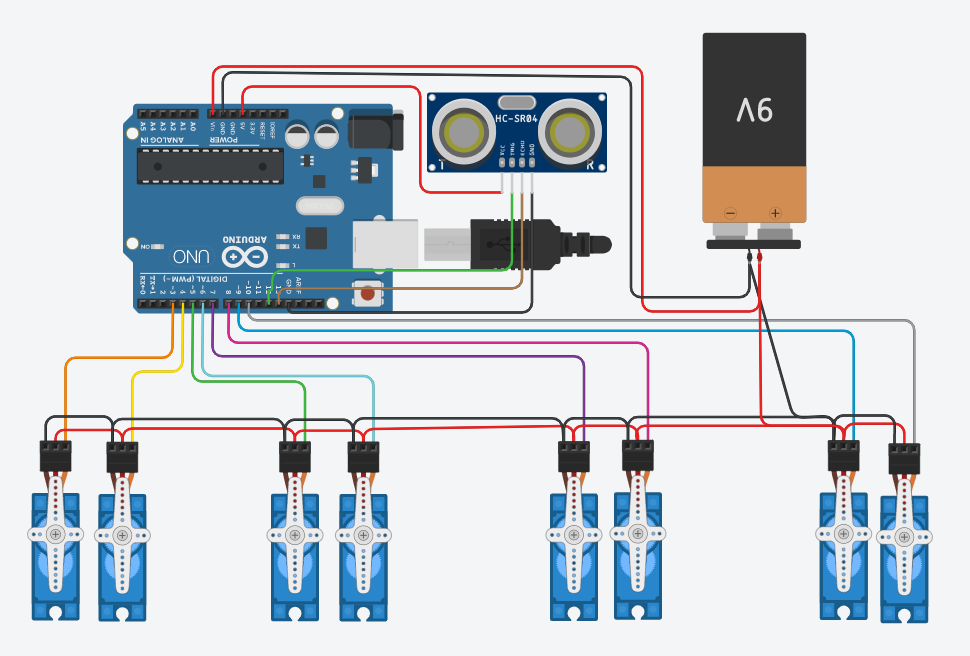

# SpiderBot

> ##### Autores: [@atrsp](https://github.com/atrsp), [@felipemattosv](https://github.com/felipemattosv) e [@vitordcgomes](https://github.com/vitordcgomes).

### **Troféu de destaque na [IV Mostra Projeto Integrado em Computação -2022/2](https://computacao-ufes.github.io/mostra/pic_EC_20222.html) !**
##### **Objetivo:** Criar uma solução integrando hardware e software.

##### **Resumo:** Nosso projeto consiste na produção de uma aranha robótica constituída de uma estrutura em acrílico, 8 micro servos, um sensor ultrassônico para detectar obstáculos no caminho, o Arduino UNO R3 e uma bateria para alimentação.

##### **Detalhamento:** nesse projeto, estamos desenvolvendo uma aranha robótica que muda de direção ao detectar um obstáculo a menos de 30cm de distância, evitando colisões.

##### **Software:**
Diagrama da lógica:

##### O Código utiliza a biblioteca `Servo.h`, própria para controlar micro servos. Dela, foram utilizadas as funções:
- `attach()`: Define o pino de sinal ligado a cada servo;
- `write()`: Define a posição do servo (em graus);

##### **Hardware:**
- Controle: Arduino UNO R3
- Corpo e pernas: Estrutura em acrílico
- Movimento: (8) Micro servos SG90
- Reação: Sensor ultrassônico HC-SR04
- Alimentação: Bateria 9V conectada a uma Sensor Shield

##### Obs.: A pilha 9V é conectada ao borne de uma Sensor Shield, que distribui a energia pelos componentes do circuito.
##### A aranha possui 4 pernas, com 2 servos por perna. Um dos servos se encontra na articulação entre o corpo e a perna, com o papel de movimentar as pernas para frente e para trás. Já o outro, está localizado na articulação entre as 2 peças que compõem a perna, com a função de levantá-la ou abaixá-la.
